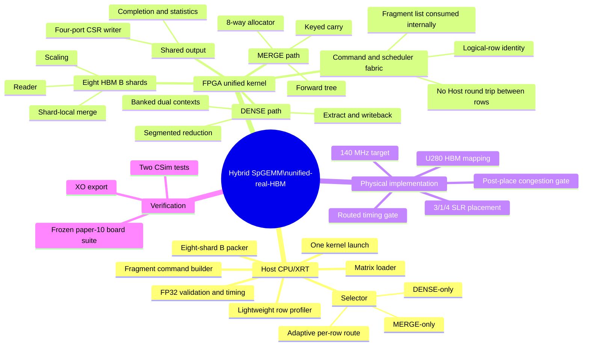
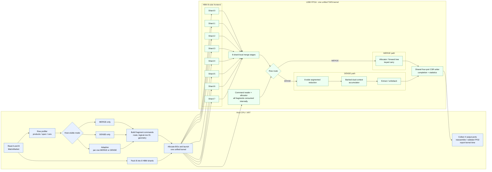

# Hybrid SpGEMM: current unified-real-HBM checkpoint

This repository intentionally contains only the active U280/TAPA design, not
historical implementations, generated HLS/Vivado projects, matrices, or FPGA
bitstreams.

## Design boundary

The Host exposes three modes: `merge-only`, `dense-only`, and `adaptive`.
In adaptive mode it chooses MERGE or DENSE for each output row.  The FPGA
remains a single unified kernel: eight HBM B-shards feed the shared allocator,
the MERGE forward tree or DENSE dual-context accumulator, then the common
four-port CSR writer.  No external DMSA kernel is a selectable path.

The current v12 candidate retains all eight HBM shards and the full MERGE and
DENSE paths.  Its only pending physical experiment is shallower elastic FIFO
depths, intended to reduce CLB/SLL placement pressure without changing the
algorithm or Host-visible behavior.

## Source map

### Host code (CPU/XRT)

| File | Responsibility |
| --- | --- |
| `src/host_adaptive_hbm_unified_real.cpp` | Host entry point for this kernel. |
| `src/host_adaptive_hbm_spgemm_dim_commanded.cpp` | Builds the one-invocation fragment command list, retaining each complete logical-row identity. |
| `src/host_adaptive_hbm_spgemm_scalable.cpp` | Matrix loading, selection, eight-shard B packing, XRT launch, result collection, FP32 checking, and kernel-time measurement. |
| `src/adaptive_light_selector.h`, `src/adaptive_route_model.h`, `src/rowpersistent_selector_policy_robust_v3_generated.h` | Lightweight row-feature/cost-model policy for `MERGE`, `DENSE`, and adaptive row routes. |
| `src/adaptive_hbm/adaptive_hbm_route_word.h`, `src/host_device_utils.h` | Host/kernel route ABI and XRT helpers. |

### FPGA kernel code (TAPA/HLS)

| File or directory | Responsibility |
| --- | --- |
| `src/adaptive_hbm_tapa/experimental/unified_real_hbm/adaptive_hbm_unified_real_hbm_tapa.cpp` | **Kernel Top**: consumes all commands in one launch, drives eight HBM B shards, routes each row into MERGE or DENSE, and connects the common output network. |
| `src/adaptive_hbm_tapa/experimental/unified_real_hbm/*.h` | Top-level ABI. The two `*_tb.cpp` files are the current CSim tests. |
| `src/adaptive_hbm_tapa/adaptive_hbm_tapa_scalable.{h,cpp}` and `adaptive_hbm_tapa_merge_fabric.hpp` | Production reader, B scaling, shard-local merge, and stream/token definitions. |
| `experimental/merge_allocator8`, `merge_forward_tree8`, `merge15_packetmeta4` | MERGE path: row allocator, 8-way forward tree, and four-port packetized CSR output. |
| `experimental/segmented8_shared`, `merge_keyed_carry8`, `unified_dense_dual_context` | DENSE path: pre-bank segmented reduction, cross-packet duplicate carry, banked dual-context accumulation, extraction, and writeback. |
| `experimental/unified_adaptive_datapath`, `unified_allocator_merge_output`, `unified_adaptive_full_output` | Integration layers that assemble the two paths into one routed, ordered-output graph. |

### Build and implementation files

| File | Responsibility |
| --- | --- |
| `src/u280_unified_real_hbm_140_plramstats.cfg` | U280 HBM bank mapping and 140 MHz clock target. |
| `tools/run_adaptive_hbm_unified_real_hbm_tapa_csim.sh` | Kernel CSim gate. |
| `tools/run_adaptive_hbm_unified_real_hbm_tapa_compile.sh` | Exports the TAPA kernel to an XO. |
| `tools/build_adaptive_hbm_unified_real_host.sh` | Builds the CPU/XRT Host executable. |
| `tools/link_adaptive_hbm_unified_real_hbm_140_slr314.sh` | Vitis link with the 3/1/4 local-MERGE SLR placement. |
| `tools/place_tapa_local_merge_balanced_slr_20260828.tcl`, `tools/capture_adaptive_hbm_postplace_diagnostics_20260828.tcl` | SLR constraints and the post-place congestion/timing gate. |
| `tools/run_unified_real_hbm_paper10_board_20260904.sh` | Frozen ten-matrix, ten-repetition board measurement after timing closes. |

### Design mind map

### Host–FPGA architecture

## Reproduction order

1. Install TAPA, Vitis/Vivado 2022.2, XRT, and the U280 2022.1 platform.
   Point `tools/tapa_local` in the scripts to a local TAPA installation; it is
   deliberately not versioned.
2. Run `tools/run_adaptive_hbm_unified_real_hbm_tapa_csim.sh`.
3. Build the XO with `tools/run_adaptive_hbm_unified_real_hbm_tapa_compile.sh`.
4. Link with `tools/link_adaptive_hbm_unified_real_hbm_140_slr314.sh` and use
   its post-place reports as a congestion gate before routing.
5. Build the Host using `tools/build_adaptive_hbm_unified_real_host.sh`, then
   run the frozen paper-10 board script after a timing-clean xclbin exists.

Generated outputs are excluded by `.gitignore`.
